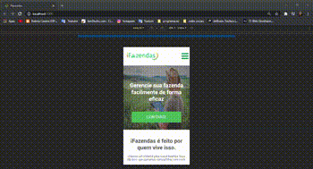

<h1>
    
    <p>Website para iFazendas, um sistema de gerenciamento de fazendas.🟨🟧🟩📈</p>
</h1>

<h1>
     <p>▶ Preview Web/ mobile</p>
     
</h1>

## 📚 Sobre

**iFazendas** é um projeto para uma companhia fictícia de gerenciamento de fazendas, com o intuito de  testar conhecimentos e habilidades. Foi criado o layout usando **Figma**, logomarca usando **Photoshop** e, em seguida, criado o web site usando **ReactJs** para estrutura e scripts, **sweet alert 2** para um alerta estilizado e **Firebase** para salvar formulários enviados.

## 🔨 Ferramentas

- Figma
- Photoshop
- ReactJs
- SweetAlert2
- Firebase

## ✅ Veja o projeto online

- <a target="_blank" href="http://projeto-ifazendas-koala-dev.vercel.app/">Link do projeto online</a>

## 🔁 Clonando repoitório e rodando

- Clone o repositório

```bash
    git clone https://github.com/wagnersillva/projeto-teste-ifazendas.git
```
- Entre na pasta
``` bash
    cd projeto-teste-ifazendas
```

- instale as dependências 

``` bash
    npm install
```

- Rodando o projeto

``` bash
    npm start
```

